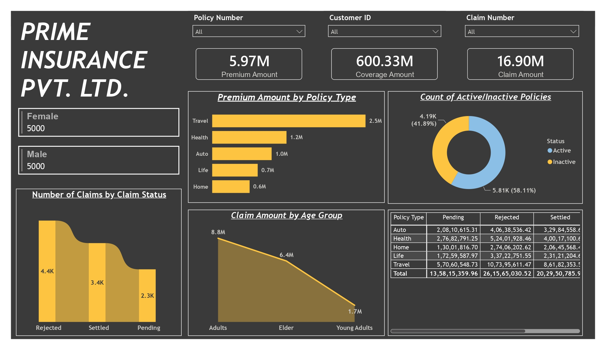

# Data-Analyst-Project

# Project Overview

This is a self study project completed as part of my learning in Data Analytics.

The project mainly focuses on analyzing insurance data to understand policy performance, premium amounts, coverage, claims and customer demographics.

The project demonstrates the complete workflow from data preparation and SQL analysis to Power BI dashboard development and business insights.

## Objectives

- Analyze insurance policy performance.
- Analyze premium and coverage amounts.
- Understand claim related information and claim status.
- Analyze customer demographics.
- Create meaningful KPIs for business reporting.
- Develop an interactive Power BI dashboard.
- Generate insights from the available insurance data.

## Tools and Technologies

- **Microsoft Excel:** Initial Data Source.
- **MySQL:** Data Storage and Querying.
- **Power BI:** Dashboard Development and Data Visualization.
- **DAX:** KPI and analytical calculations.

## Data Preparation & Connection

The raw insurance data was initially available in Excel and was migrated into MySQL for structured data storage and querying. The MySQL database was then connected directly to Power BI for data analysis and dashboard development.

The data was prepared for analysis by:
- Reviewing the structure and quality of the data.
- Identifying duplicate records.
- Removing unnecessary records.
- Applying required transformations.
- Preparing the data for Power BI reporting.

## Analysis Performed

The analysis focused on:
- Policy Volume.
- Premium Amounts.
- Coverage Amounts.
- Claims.
- Claim Status.
- Customer Demographics.

## Key KPIs

The dashboard provided KPI based analysis of:
- Total Policies.
- Premium Amount.
- Coverage Amount.
- Claims.
- Claim Status.

These KPIs provide an overview of insurance business and claims related performance.

## Dashboard

The Power BI dashboard provides an interactive view of insurance related metrics and allows the data to be analyzed across different business dimensions.

## Dashboard Preview

## Key Insights

The analysis provides visibility into:
- Overall Policy Performance.
- Premium and Coverage Distribution.
- Claim Status Patterns.
- Customer Demographic Distribution.
- Insurance and Claim Related Trends.

These insights demonstrate how raw business data can be transformed into KPI based reporting to support analysis and decision making.

## Project Workflow

Excel Dataset 
  ↓ 
MySQL 
  ↓ 
Power Query 
  ↓ 
Data Cleaning & Transformation 
  ↓ 
Power BI 
  ↓ 
DAX/KPIs 
  ↓ 
Interactive Dashboard 
  ↓ 
Business Insights 

## Skills Demonstrated

- SQL.
- Data Cleaning.
- Data Transformation.
- Data Analysis.
- Power Query.
- Power BI.
- DAX.
- KPI Development.
- Data Visualization.
- Business Reporting.
- Business Insights.

## Disclaimer

This project was created as a self study practice project while learning Data Analytics. It is not a professional/client project.
